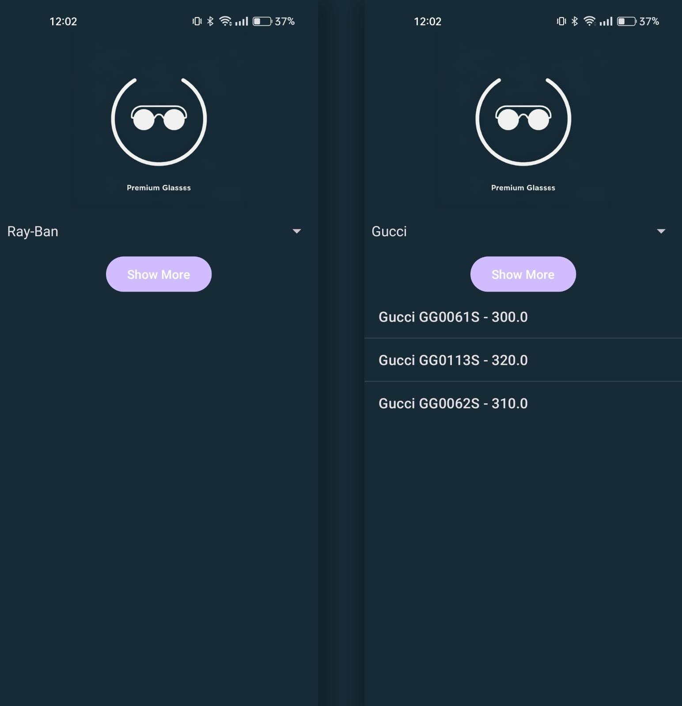

# SpinnerTest

This is a simple Android application demonstrating the use of the Spinner widget. This project is part of a mobile development course at university.



## Features

- Displays a list of brands in a Spinner.
- Shows a list of glasses related to the selected brand when a button is clicked.

## Project Structure

- `app/src/main/AndroidManifest.xml`: Contains the application manifest.
- `app/src/main/java/com/example/myapplication/Brands.java`: Defines the `Brands` class.
- `app/src/main/java/com/example/myapplication/Glasses.java`: Defines the `Glasses` class.
- `app/src/main/java/com/example/myapplication/MainActivity.java`: Contains the main activity logic.
- `app/src/main/res/layout/activity_main.xml`: Defines the layout for the main activity.
- `app/src/main/res/values/styles.xml`: Contains the custom styles used in the application.

## How to Run

1. Clone the repository:
    ```sh
    git clone https://github.com/Rasheed-Al-Qobbaj/SpinnerTest.git
    ```
2. Open the project in Android Studio.
3. Build and run the application on an emulator or physical device.

## Usage

1. Select a brand from the Spinner.
2. Click the "Show More" button to display a list of glasses related to the selected brand.

## Dependencies

- Android SDK
- AndroidX libraries
- Gradle